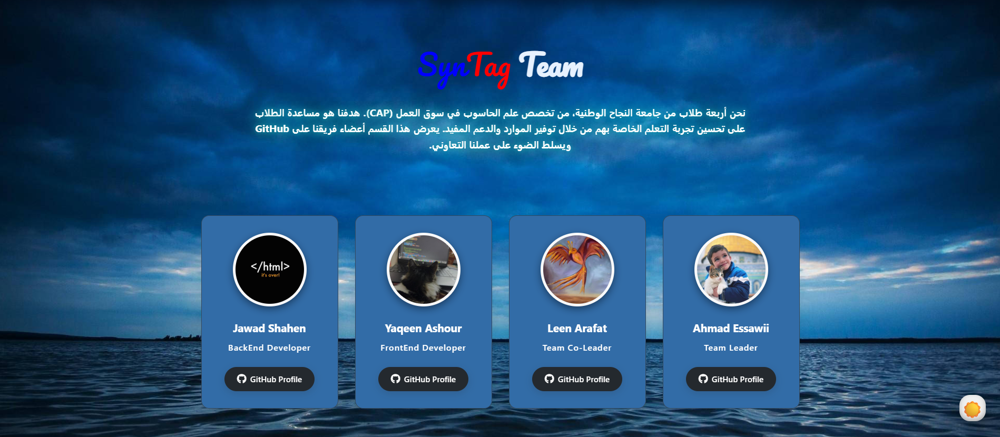

# 🌟 نجاحي – منصة تعليمية لطلاب الثانوية

**نجاحي** هو موقع تعليمي لطلاب الصفوف **العاشر، الحادي عشر، والثاني عشر**، يقدم محتوى مبسّط ومنظم لمساعدة الطلاب على التفوق الأكاديمي. الموقع مبني باستخدام **React** ويدعم **اللغة العربية بالكامل (RTL)**.

---

## 🧩 المميزات

- واجهة بسيطة وسهلة الاستخدام  
- أقسام لجميع الصفوف والفروع (علمي وأدبي)  
- مواد تعليمية متنوعة: رياضيات، فيزياء، كيمياء، أحياء، إنجليزي، عربي، تاريخ، تكنولوجيا، تربية إسلامية  
- دعم عبر البريد الإلكتروني والذكاء الاصطناعي  
- تصميم متجاوب وسريع  

---

## 🏗️ هيكل المشروع

- **الNavbar**: شريط التنقل الرئيسي  
- **الGrades Section**: بطاقات المواد حسب الصفوف والفروع  
- **الAbout Section**: تعريف بالمنصة ورسالتها  
- **الSupport Section**: خيارات الدعم المختلفة  
- **الFooter**: معلومات التواصل وروابط مهمة  

---

## 💡 المطورين

تم تطوير هذا المشروع لدعم الطلاب وتسهيل الوصول إلى محتوى تعليمي منظم وموثوق.

